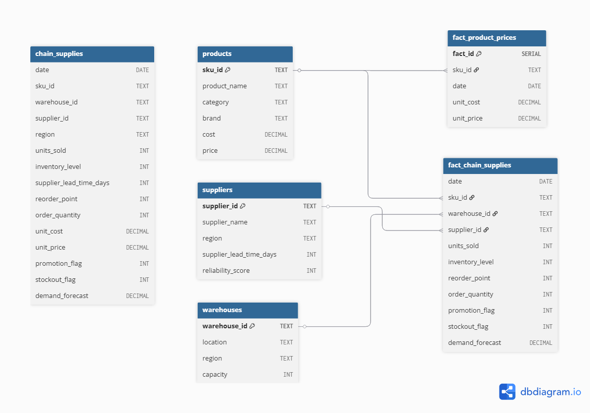

# 📦 Supply Chain Analytics Project

## 📌 Overview

This project analyzes a simulated **supply chain dataset** to extract insights into **inventory efficiency, forecasting accuracy, supplier performance, and profitability**. The dataset was transformed into a **relational database schema** and visualized with **Power BI**.

## 📊 Dataset

* Source dataset: *Chain Supplies* (from Kaggle).
* Enriched with attributes for **products, suppliers, and warehouses**.
* Final structure includes **fact tables** for transactions and prices, and **dimension tables** for products, suppliers, and warehouses.

## 📌 Original Data Source

* [Kaggle – Supply Chain Dataset](https://www.kaggle.com/) *(reference link placeholder)*
* Additional attributes (product brands, supplier reliability, warehouse capacity) were added to enrich the dataset.
* The raw table is used only as a staging layer for populating the final fact and dimension tables.

## 🛠️ Tools & Technologies

* **PostgreSQL** → data modeling, SQL analysis.
* **Power BI** → dashboards and visualizations.
* **SQL** → schema design, ETL, KPIs.
* **GitHub** → project documentation and version control.

## ❓ Key Business Questions

1. How efficiently are products moving through the supply chain?
2. How long will inventory last given current demand?
3. How accurate are the demand forecasts?
4. What is the balance between service level and stockout rate?
5. Which suppliers are most reliable?
6. Which SKUs and regions drive the most profitability?

## 📂 Repository Structure

sql/        → database schema, load script, and analysis queries  
docs/       → ERD  
images/     → screenshots of dashboards (Power BI) and query results (pgAdmin)  
README.md   → project summary and instructions  

## 🗄 Database Schema & ERD

- The database schema is defined in [SCHEMA](sql/SCHEMA.sql)
- It creates the following key tables:
  * products → product catalog with category & brand.
  * suppliers → supplier info with lead time & reliability.
  * warehouses → warehouse location & capacity.
  * fact_chain_supplies → fact table with sales, inventory, forecasts, stockouts.
  * fact_product_prices → product cost & price by date.

## 📌 Entity-Relationship Diagram (ERD):

### 🔄 How to Reproduce
- Create a PostgreSQL database:
      * In pgAdmin → right-click Databases → Create - Database → name it `supply_chain` (or any name you preffer).
- Schema & Data Import:
      * Run the schema script in [SCHEMA](sql/SCHEMA.sql) to create all tables and insert data.
- Sample queries:
      * Analytical SQL queries are available in [Analysis](sql/Analysis.sql).
      * These queries can be run in pgAdmin or connected directly to Power BI for visualization.

## 📈 Power BI Dashboard

The dashboard includes:

* **KPIs**: revenue, profit, turnover ratio, level service
* **Charts**:

  * Bar chart → Inventory Turnover Ratio ... [Turnover ratio](images/BI_1_turnover_ratio.png)
  * Line chart → Days of Inventory on Hand ... [DoH](images/BI_2_doh.png)
  * Scatter plot → Forecast Accuracy (MAPE) ... [Mape](images/BI_3_mape.png)
  * Combo chart → Service Level & Stockout Rate ... [Service level](images/BI_4_service.png)
  * Bubble chart → Supplier Reliability vs. Lead Time ... [Relliability](images/BI_5_reliability.png)
  * Line chart → Profitability by SKU & Region ... [Profitability](images/BI_6_profitability.png)
  * [Overall Chart](images/Overall_chart.png)

## ✅ Key Takeaways

* Inventory turnover and DOH highlight efficiency vs. overstock.
* Forecast accuracy (MAPE) is critical to prevent stockouts.
* Supplier reliability directly impacts service levels.
* Profitability analysis identifies **winning products and regions**.
* Power BI turns SQL insights into **decision-ready dashboards**.
